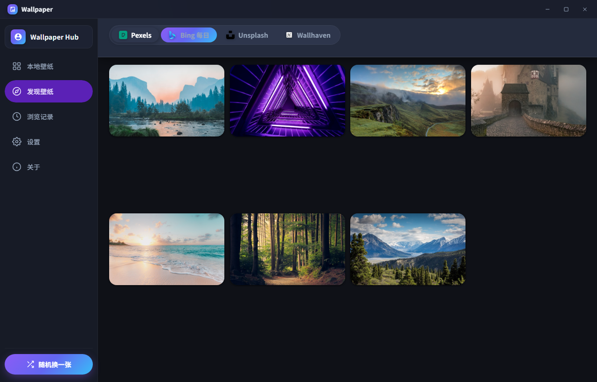
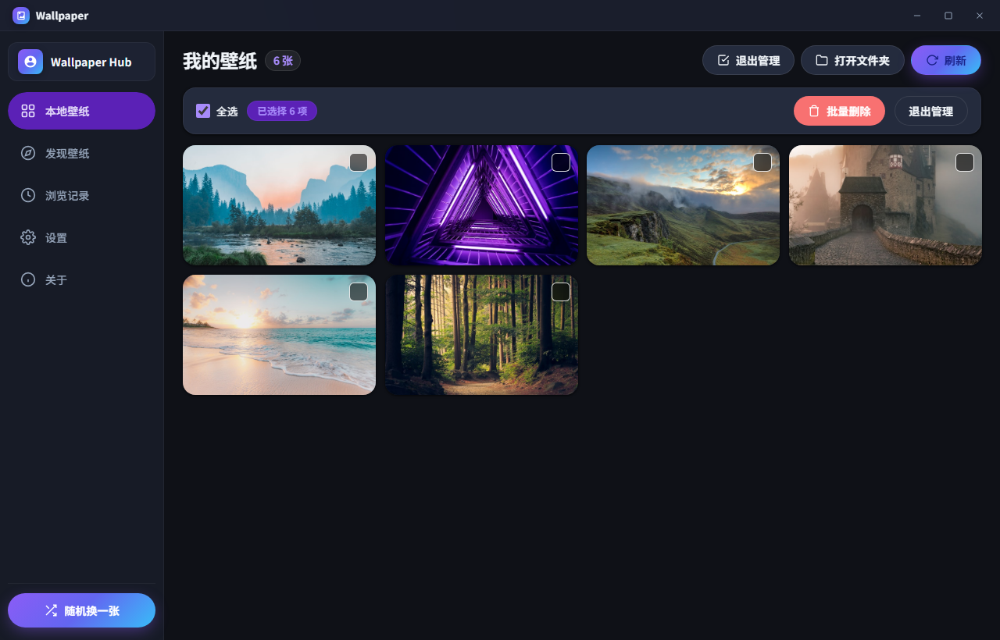
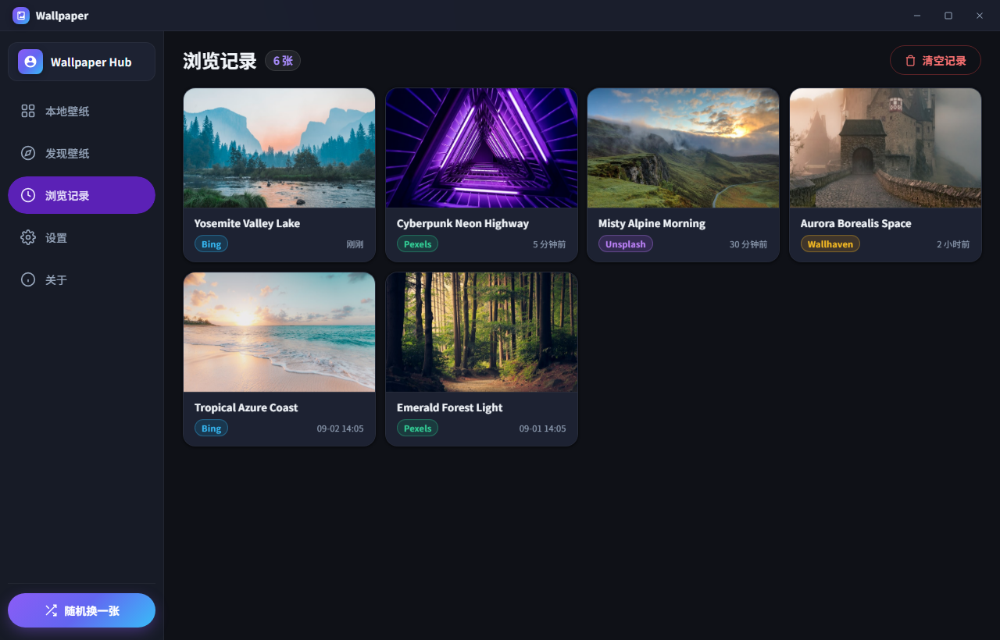
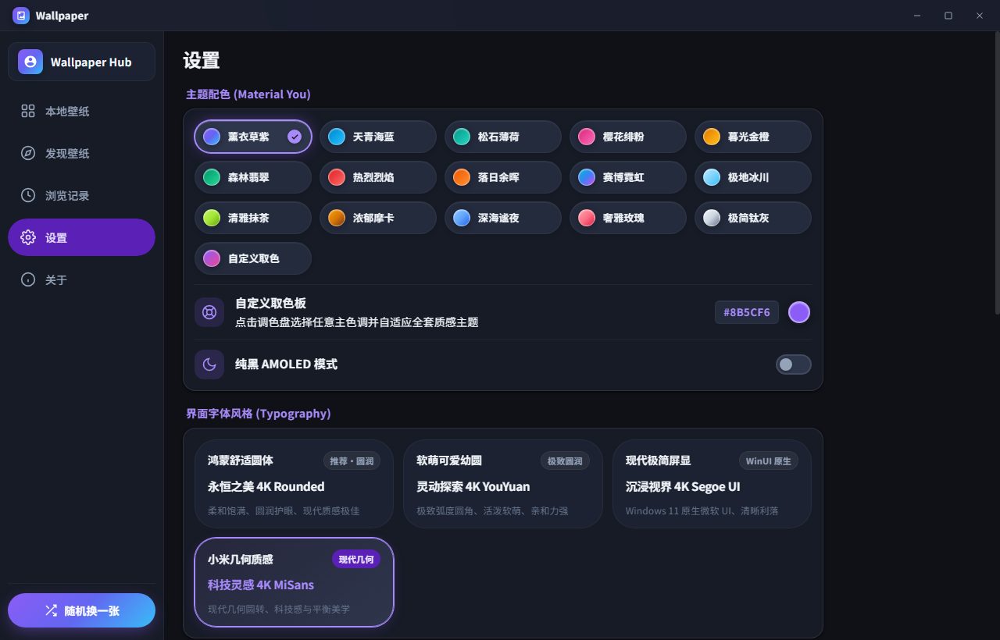
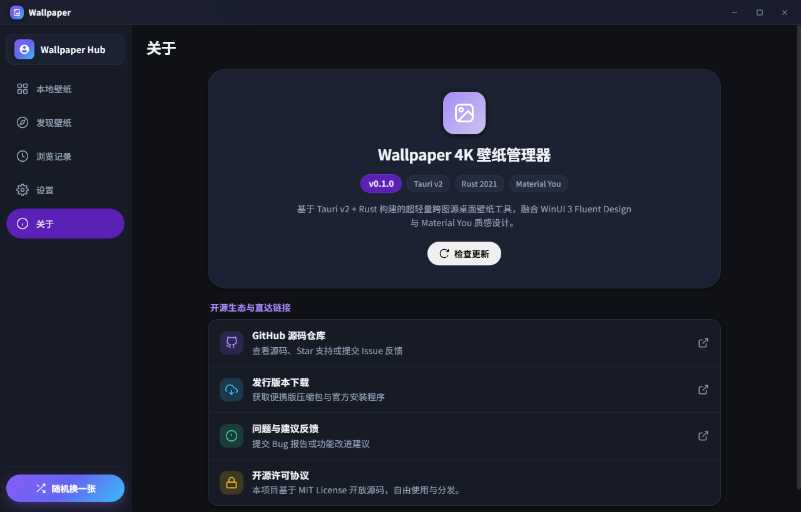

<div align="center">

# Wallpaper 4K

**Tauri v2 + Rust で構築された超軽量・マルチソース対応デスクトップ壁紙管理アプリ**

Windows 11 WinUI 3 Fluent Design と Material You の美しい融合

[简体中文](README.md) • [English](README_en.md) • [日本語](README_ja.md) • [한국어](README_ko.md)

<br/>

[](https://github.com/Mokssa/wallpaper_app/releases)
[](https://www.rust-lang.org/)
[](https://tauri.app/)
[](LICENSE)
[](https://www.microsoft.com/windows)

</div>

---

## 📸 スクリーンショット (Screenshots)

<div align="center">

### 壁紙を探す (Explore)
複数のオンラインソースから4K超高画質壁紙を閲覧。タグフィルターやキーワード検索に対応。


### ローカル壁紙と一括管理 (Local Gallery & Batch Mode)
ワンクリックで壁紙適用。個別削除の確認ダイアログ、複数選択による安全な一括削除に対応。


### 閲覧履歴ギャラリー (Browsing History)
閲覧した壁紙をローカルに自動保存。いつでも過去のお気に入りを見直し、再適用や確認ダイアログ付きの一括クリアが可能。


### テーマとフォント設定 (Material You & Typography)
12種類のダイナミックテーマ、カスタムカラーパレット、ピュアブラックAMOLEDモード、4種類の美しいフォントプリセット。


### 独立したアプリ情報ページ (About & Update Engine)
アプリバージョンとオープンソースエコシステムを独立したページで表示。GitHub API制限を自動回避する更新確認機能を搭載。


</div>

---

## ✨ 主な機能

- **マルチソース対応** — Bing デイリー壁紙、Pexels 写真、Unsplash アート、Wallhaven アニメ/CG コミュニティを統合。
- **純粋な無限スクロール** — ページネーションを廃止し、滑らかな無限スクロールで次々と美麗な壁紙を自動読み込み。
- **閲覧履歴ギャラリー** — クリックした壁紙を自動でローカル記録。専用タブでいつでも再確認、デスクトップ壁紙への適用、履歴の安全な消去が可能。
- **安全な一括管理と削除確認** — 単一削除と複数選択の一括削除の双方に、誤操作を防ぐ Material 3 モーダル確認ダイアログを搭載。
- **4言語国際化 (i18n)** — 簡体字中国語 (zh-CN)、英語 (en-US)、日本語 (ja-JP)、韓国語 (ko-KR) にネイティブ対応。システムの言語設定に自動適応（一致しない場合は自動的に簡体字中国語へフォールバック）。
- **Material Design 3 + WinUI 3 デザイン** —
  - **12種類のテーマカラー**：スカイブルー、ミントグリーン、チェリーピンク、サンセットゴールド、フォレストエメラルド、クリムゾンフレーム、夕暮れアンバー、サイバーネオン、ポーラーグラシエ、抹茶グリーン、モカブラウン、ディープナイト。
  - **カスタムカラーピッカー**：任意の16進数カラーコードを選択し、システム全体の調和したカラートークンを自動生成。
  - **ピュアブラック AMOLED モード**：真の漆黒背景で目に優しく、省電力。
  - **4つの厳選フォント**：HarmonyOS Rounded、ソフト幼円、モダン Segoe UI、幾何学 MiSans。
- **レートリミットフリーの更新確認エンジン** —
  - 通常時は GitHub Release REST API から詳細な更新ログを取得。
  - GitHub APIの403 Forbidden（未認証IP制限）検知時は、HTTP 302 リダイレクト解析へ自動フォールバックし、制限なしで確実に最新バージョンを確認。
- **圧倒的な軽量性と省メモリ** — Rust 2021 + Windows Win32 API (`SystemParametersInfoW`) による直接制御。わずか数十MBのメモリで高速動作。
- **自動巡回とタスクトレイ常駐** — Windows 起動時の自動起動、トレイ最小化、ダブルクリック復元、指定間隔での壁紙自動切り替え。

---

## 🛠️ 技術スタック

| コンポーネント | 技術 | 説明 |
|---|---|---|
| **フレームワーク** | [Tauri v2](https://v2.tauri.app/) | Rust ベースの超軽量デスクトップ基盤 |
| **バックエンド** | Rust 2021 + Tokio + Reqwest | 高速非同期 I/O と安全なネットワーク通信 |
| **壁紙設定** | Win32 `SystemParametersInfoW` + Windows レジストリ | 6種類の配置スタイル直接適用 |
| **UI** | HTML5 / CSS3 / ES2022 (Native) | 外部重量級ライブラリ不使用、M3リップルエンジン内蔵 |
| **ウィンドウ効果** | window-vibrancy | Windows 11 Mica / Acrylic 半透明効果 |

---

## 🚀 ビルドと実行

### 必要条件
- Windows 10 (Build 19041+) または Windows 11
- [Rust](https://rustup.rs) ツールチェーンおよび Visual Studio C++ ビルドツール (MSVC)
- Node.js 18+

### ビルド手順

```powershell
# 1. リポジトリのクローン
git clone https://github.com/Mokssa/wallpaper_app.git
cd wallpaper_app

# 2. 依存パッケージのインストール
npm install

# 3. テストの実行 (Rust 単体テスト + 285以上のUIテスト)
cargo test
npm test

# 4. 開発モードで実行
cargo tauri dev

# 5. リリースビルド
cargo tauri build
```

実行ファイルは `target/release/wallpaper_app.exe` に生成されます。

---

## ⚙️ 設定ファイル

初回起動時に `config/settings.json` が生成されます：

```json
{
  "cache_dir": "cache/wallpapers",
  "wallpaper_style": "fill",
  "auto_update_enabled": false,
  "auto_update_interval_minutes": 60,
  "random_source": "all",
  "theme_color": "indigo",
  "custom_theme_color": null,
  "amoled_mode": false,
  "font_family": "misans",
  "language": "ja-JP",
  "load_mode": "pagination",
  "card_ratio": "uniform",
  "unsplash_access_key": "",
  "pexels_api_key": ""
}
```

> **🔒 プライバシー保護**：APIキーおよび個人設定はお使いのPCのローカルファイルにのみ保存されます。外部サーバーへのテレメトリやデータ送信は一切行いません。

---

## 📄 ライセンス

本ソフトウェアは [MIT License](LICENSE) のもとで公開されています。
